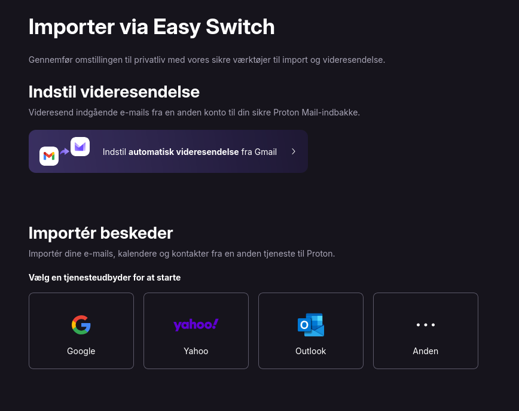
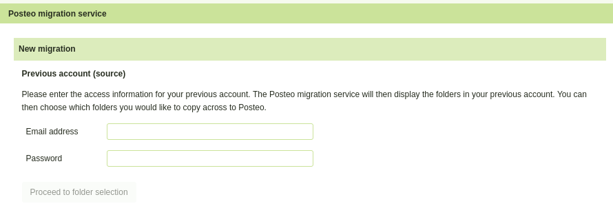

På <https://european-alternatives.eu/> findes et katalog over europæiske alternativer indenfor digitale produkter og tjenester.
Her findes i skrivende stund 21 alternativer i kategorien 'Email Providers' (email udbydere).

Jeg har afprøvet [Posteo](https://en.wikipedia.org/wiki/Posteo) og [Proton](https://en.wikipedia.org/wiki/Proton_Mail).
Der var ikke nogen særlig grund til at det lige var de to, det var blot dem jeg først hørte om.

Jeg vil her fortælle lidt om mine erfaringer, med speciel vægt på import fra tidligere email udbyder.

Posteo er baseret i Berlin, og har tilbudt email tjeneste siden 2009.
De tilbyder en prøveperiode på 14 dage, hvor man får pengene tilbage, hvis man ikke ønsker at fortsætte derefter.
Mindsteprisen er pt. 1 EUR pr. måned for 2GB plads. Man kan udvide pladsen op til højst 20GB, og betaler så mere afhængigt af mængden af plads.

Proton har hovedsæde i Geneve, og blev grundlagt i 2014.
Her kan man få et gratis abonnement med 500MB plads. Skal man bruge mere (det skal de fleste jo nok), kan man få 15GB for 4 EUR pr. måned.

Begge udbydere har en udmærket webmail.

Det skal bemærkes, at Posteo kun pt. kun findes med engelsk, tysk og fransk brugergrænseflade.
Proton's brugergrænseflade er derimod oversat til dansk.

Proton tilbyder udover email også opbevaring af filer (samme funktionalitet som Google Drive), kalender, password manager og VPN.
Alt tilgængeligt på mobile enheder med iOS eller Android via Proton's egenudviklede apps.
Via Proton Drive app'en kan man dertil indstille automatisk backup af fotos fra mobile enheder.

Posteo har ikke funktionalitet udover email, kalender og addressebog.
De har ikke udviklet egne apps, men i stedet kan man sætte sin Posteo konto op i en
generel mobil-mail app, eksempelvis K-9 Mail (Thunderbird på mobil).
Man kan selvflg. også bare bruge webmail grænsefladen.

Jeg har testet import af min eksisterende mail konto til både Proton og Posteo.
I det følgende beskriver jeg mine erfaringer med det.

# Før import til ny email udbyder

Før man giver sig i kast med at importere fra sin gamle postkasse, er der et par ting man bør overveje.

-   Hvor meget plads bruger ens nuværende postkasse?

-   Har man nogle emails som fylder meget - måske endda mere end den nye udbyder tillader?

Min gamle mail konto (på Gmail) havde, inden jeg flyttede den, ca. 4GB email.
Det kunne jeg se på denne side

<https://one.google.com/storage/management>

hvor forbrug er delt op på email, fotos, filer og andet.

For at få plads til det på Proton, måtte jeg købe Proton Mail Plus som koster ca. 4 EUR månedligt (det er billigere hvis man køber 12 måneder).

På Posteo måtte jeg udvide den tilgængelige plads fra de 2GB først.

Posteo har iøvrigt en smart funktion, hvor man kan justere den tilgængelige plads op og ned efter behov:

Hvis nogle af dine emails fylder mere end den nye udbyder accepterer, så kan det sagtens være at de ikke kommer igennem
importen.

I så fald vil det være en god ide at gemme indholdet af disse emails på din egen computer (kan gøres før eller efter importen).

Posteo tillader 50MB, mens Proton har en grænse på 25MB.

Hvis man kommer fra Gmail, kan man finde emails der fylder mere end fx. 25MB, ved at indtaste

`size:25M`

i søgefeltet:

Den før nævnte side <https://one.google.com/storage/management> kan også bruges til at fremfinde store mails, med henblik på sletning eller nedhentning.

# Import til Proton

Proton har en brugervenlig funktion indbygget, der kan importere emails, kontakter og kalender fra anden email udbyder.
Det findes i webmail under Indstillinger -> Import via Easy Switch.

Inden man starter import processen, er det en god ide at sætte videresendelse fra ens gamle postkasse op,
så mails der modtages efter importen slutter også kommer over i den nye postkasse.

Hvis man (som jeg) flytter fra Gmail, kan det gøres direkte på Easy Switch siden.
Ellers må man kigge i sin gamle udbyders dokumentation for at se hvordan man sætter videresendelse op.

Selve importen er lettest hvis man kommer fra Gmail, Outlook eller Yahoo.
Ellers må man selv sætte en specifik adgangskode op på den gamle mail konto (og evt. åbne for anvendelse af IMAP).

En nyttig detalje er at Proton automatisk mærker de importerede mails med en speciel unik etiket.
Så hvis man efterfølgende fortryder noget ved importen, er det relativt nemt at slette alle de importerede mails og starte forfra igen.

Mine ca. 4GB af emails, kalender og adressebog tog ca. 15 timer at kopiere over. Det tror jeg er ganske hurtigt for den slags øvelser.
Da importen var færdig, sendte Proton mig en mail med en oversigt over importen, herunder pr. folder: antal fundne mails, antal importerede mails,
antal mails der var duplikerede mellem foldere i den gamle postkasse, samt mails der blev afvist af importen.
En håndfuld mails blev afvist pga. "ukendt afsender" og/eller at det tydeligvis var spam.

Min adressebog kom ligeledes fint over. Jeg har ikke brugt Google kalenderen meget, men de få aftaler jeg har kom rigtigt over.

Jeg bemærkede også at det angivne pladsforbrug efter import var noget lavere hos Proton - 2.3GB - end det var hos Gmail (3.9GB).
Det skyldes formentlig dels at Proton har krypteret/komprimeret indholdet, dels at Proton har identificeret mange mails som duplikater af
andre mails.

# Import til Posteo

Ligesom ved Proton Mail, er det en god ide at sætte videresendelse fra ens gamle postkasse op forlods.
Man kan kigge i sin gamle udbyders dokumentation for at se hvordan man sætter videresendelse op.
Eller man kan bruge en funktion under Settings -> Email Collector der sætter det op.

Posteos webmail indeholder en funktion "Migration Service" som kan bruges til at importere emails mm.
Det findes i webmail under Settings -> Posteo migration service.

Hvis man kommer fra en mail udbyder der har 2-faktor autentificering, som fx. Gmail har, så
skal man først have lavet et specifikt app-password, som så er det der her skal indtastes.

Kommer man fra Gmail, kan man lave et sådant app-password via siden <https://myaccount.google.com/apppasswords>

Efter indtastning af app password, klik på "Proceed to folder selection".
Der går lidt tid, hvorefter værktøjet viser en liste med foldere fra den gamle postkasse, som man
kan vælge at medtage i migreringen.
Man kan også vælge at importere adressebog, men i så fald kræves der endnu et password (jeg gætter på det kræver endnu et
app-password, men jeg prøvede det ikke).

Det ser ikke ud til at import af kalender fra Gmail er understøttet i Posteos Migration Service.
Deres dokumentation nævner, at kalendre fra bl.a. Gmx, web.de, AOL og iCloud kan importeres.

Importen er sat op til at placere mails i en særskilt ny folder, så der ikke er nogen risiko for at få blandet
de importerede mails sammen med andre mails man måtte have i Posteo.

Herefter klikker man på knappen der starter importen, og nogle øjeblikke senere begynder mails at strømme ind i migrerings folderen.
Man kan se status for importen på samme side som importen blev startet fra.

# Alternativ import via email klient

Som alternativ til de værktøjer der medfølger i Proton hhv. Posteo til import fra gammel postkasse, skal det nævnes at man
også kan gøre det ved at sætte begge mail addresser op i en email klient på PC, fx. Thunderbird.
Fremgangsmåden er omtrent denne

-   Sæt begge mail addresser op i email klienten.

-   Indlæs al mail for begge mail addresser i klienten.

-   Kopier - fx. ved Drag & Drop - de ønskede mails fra gammel til ny postkasse.

Det er selvfølgelig en ret omstændelig proces (især hvis man har mange mails man vil kopiere over).
Men den kan måske være brugbar i nogle tilfælde, fx. hvis man vil skifte til en udbyder
der ikke har et værktøj til import fra gammel postkasse, eller hvis man af en eller anden grund ikke stoler på et sådant værktøj.

# Efter importen

Med videresendelse fra gammel postkasse til den nye, kan man i princippet slette alle mails i den gamle postkasse - og herefter
nøjes med at læse email i den nye postkasse.

Hvis man helt vil slette selve den gamle mail konto, skal man huske

-   At familie, venner, myndigheder mv. skal have besked om den nye mail adresse.

-   Man kan evt. have brugt den gamle email som login metode på forskellige websites og/eller apps.
    Om nødvendigt må man skifte til en anden login metode.

# Konklusioner

Både Posteo og Proton er solide og funktionsdygtige email udbydere.

Begge udbydere har værktøjer der gør det nogenlunde nemt at få kopieret emails mv. over fra gammel udbyder.

Hvis man blot ønsker en simpel email og kalender funktionalitet, så kan Posteo være en fin "minimalistisk"
løsning. Brugergrænsefladen er simplere, omend ikke så poleret som ved Proton.

Hvis man ønsker funktionalitet udover ren email og kalender, bør man checke Proton ud.
Brugergrænsefladen er meget behændig og moderne - og mere kompleks end ved Posteo.

